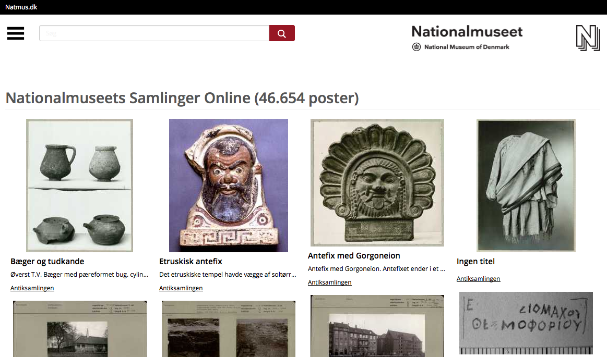

# Nationalmuseets Samlinger Online

Webapp built on top of the [Canto Cumulus](http://www.canto.com/) web service,
[Canto Integration Platform (CIP)](http://cumulus.natmus.dk/CIP/doc/index.html).
The webapp shows assets stored in the Canto Cumulus installation at the
[National Museum of Denmark](http://natmus.dk). The site is live here: http://samlinger.natmus.dk/

The webapp is built using [node.js](http://nodejs.org/), [Express](http://expressjs.com/),
[jade](http://jade-lang.com/), and [elasticsearch](http://www.elasticsearch.org/). Most of the front-end
stuff is using jQuery for performing masonry and auto suggestion. It is using the existing
[cip.js](https://github.com/NationalMuseumofDenmark/cip.js) implementation for querying CIP.

The solution is built by [Headnet ApS](http://www.headnet.dk) and [Socialsquare ApS](http://socialsquare.dk). Licensed under
[LGPL v3](https://www.gnu.org/licenses/lgpl.html).

## How to setup

First ensure that you have a running version of node.js (~0.10.20) and also [npm](https://www.npmjs.org/),
[bower](http://bower.io/) and [grunt](http://gruntjs.com/) installed. Also, download and unzip
[elasticsearch](http://www.elasticsearch.org/).
If you're on a mac it's easiest to install elasticsearch using homebrew which installs to `/usr/local/Cellar/elasticsearch/`

Then run the following commands to fetch the code and the required resources:

    $ git clone git@github.com:NationalMuseumofDenmark/natmus-samlinger.git
    $ cd natmus-samlinger
    $ npm install
    $ bower install

Now start elasticsearch

    $ cd <path to elasticsearch>
    $ bin/elasticsearch -d

Elasticsearch should be accessible on port 9200. You can verify that it is running using the following
command

    $ curl http://localhost:9200

Export CIP username and password to environment variables

    $ export CIP_USERNAME=username
    $ export CIP_PASSWORD=password

Now feed elasticsearch with data from CIP using the following command:

    $ node indexing/run.js all

Running the webapp is simple:

    $ grunt serve

And it should be accessible on ``http://localhost:9000`` using your browser.

## Harvesting tags from Google Vision and Project Oxford
For the image analyzation libraries to work, you need to set the following environment variables:

    $ export GOOGLE_API_KEY = your_google_api_key
    $ export PROJECT_OXFORD_API_KEY = your_oxford_api_key

The tags returned from these libraries are also translated through Google Translate. This combined with uploading the images
costs time and money. Therefore we don't update the tags when indexing assets unless we explicitly tell the index to do it.
To fetch tags for all assets who doesn't have any, run the any indexing query you'd like with the flag --vision.
To update the tags for an asset regardless of they have tags or not, run the query with --vision-force

## Changing the layout of an assets landing page

The layout of an assets landing page is changed via the file

    lib/config/asset-layout.json

### Sections

It specifies a list of sections.

    {
      "sections": [ ... ]
    }

Each section has:
- `title`,
- table of `rows`
- optional CSS `class` attribute, added to the table element

    {
      "sections": [{
        "title": "The place section",
        "class": "place",
        "rows": [ ... ]
      }]
    }

### Rows

Each of the rows has:
- `title` written as a label before the value
- Optional `type` - which determines how the value is presented (default: simple)

Rows that are rendered equally if supplied metadata or not, is not shown.
If all rows are not shown, the section as a whole is not shown either.

Depending on the value of type, one of more fields are required. All row types maps 1-to-1 with a template in the /app/views/includes/asset-row-types/ directory.
Adding a new template to this directory enables a new row type.

#### If the rows `type` is `simple`

The `template` will determine how the value is rendered, all fields from the assets metadata, as well as a few helper functions are available as locals.
Any valid [jade](http://jade-lang.com/) template can go into the this field.

    {
      "title": "The place section",
      "class": "place",
      "rows': [{
        "title': "The value of foo or bar",
        "type": "simple",
        "template": "| #{foo||bar}"
      }]
    }

#### If the rows `type` is `date-interval`

This type can be used to show date intervals - if the value of both ends of the interval is equal, only the date in the beginning of the interval is shown.

The `fields` is an object with two values. The metadata field name of the interval's start date as `from` and end date as `to`.

  {
    "title": "The place section",
    "rows": [{
      "title": "The value of a good date interval",
      "type": "simple",
      "fields": {
        "from": "good_start",
        "to": "good_end"
      }
    }]
  }

#### If the rows `type` is `map-coordinates`

This type can be used to show Google coordinates as text followed by a map.

The `fields` is an object with two values. The metadata field name of the coordinate `latitude` and `longitude`.

  {
    "title": "The place section",
    "rows": [{
      "title": "Map coordinates",
      "type": "map-coordinates",
      "fields": {
        "latitude": "latitude",
        "longitude": "longitude"
      }
    }]
  }

If the assetLayout is given a truly value in it's `showGeotagging` options object a pen will be shown besides the coordinates, which might be used to initiate a crowd sourcing of the coordinate pair.

## Bugs

In case you find bugs please open [an issue](https://github.com/NationalMuseumofDenmark/natmus-samlinger/issues).

## Contribute

Please fork the repository into your own github account and create a pull request whenever you are done with
your changes. Ideally, you should rebase your branch before creating the pull request in case of upstream changes.

### Linting and coding styles

From 2016 and going forward the development team has been using the following
tools for linting and aligning coding styles:

* jshint (for the Atom Editor the linter-jshint can be used)
* jscs (for the Atom Editor the linter-jscs can be used)
